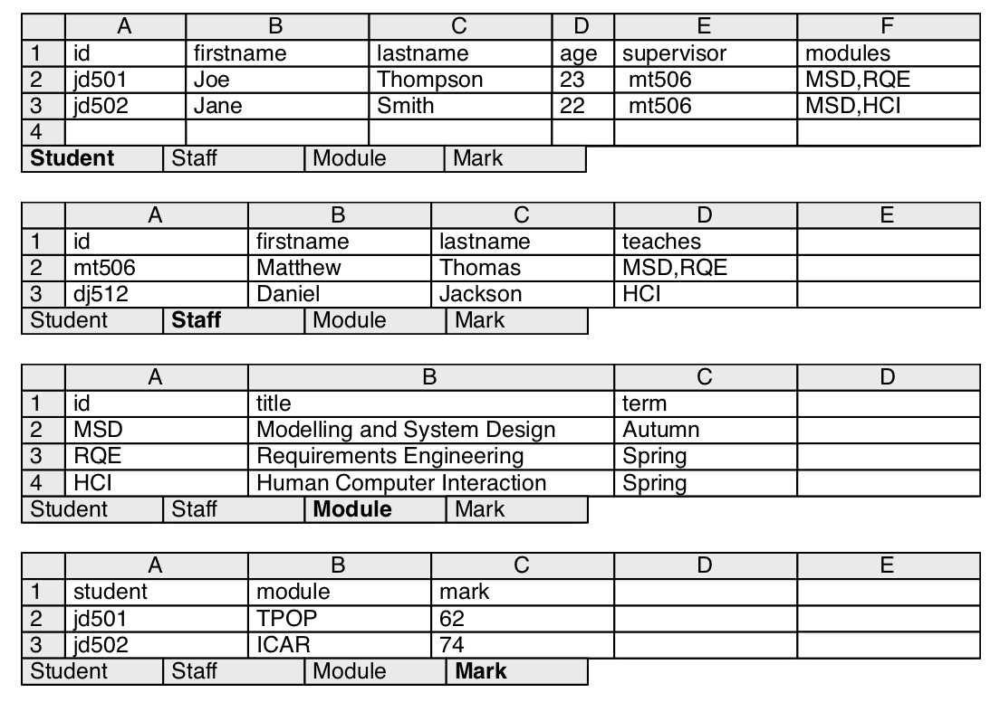

# Scripting Excel Spreadsheets using Epsilon

Epsilon provides built-in support for querying and transforming Excel spreadsheets through an [Apache POI](https://poi.apache.org/)-based [EMC](../../emc) driver. The video below demonstrates the Excel driver in action.

<iframe width="100%" height="494" src="https://www.youtube.com/embed/tTYGwgzxPMM" frameborder="0" allow="accelerometer; autoplay; encrypted-media; gyroscope; picture-in-picture" allowfullscreen></iframe>

??? info "Citing the spreadsheet driver in a publication?"
	If you are referring to Epsilon's spreadsheet driver in a publication, please cite [this paper](https://link.springer.com/chapter/10.1007/978-3-642-41533-3_3) instead of the website URL.

## Worksheets, Columns and Rows

Essentially, in the Excel driver, by default, worksheets are treated as model element types (e.g. `Student`, `Staff`, `Module` and `Mark` in the spreadsheet below), columns as their properties (e.g. `Mark` has `student`, `module` and `mark` properties), and rows are treated as model elements (i.e. there are two students, two members of staff, three modules and two marks in the model).



## References and Column Types

The driver supports specifying additional configuration information (e.g. column data types, references between columns) about a spreadsheet in the form of an external XML document, that can be attached to the spreadsheet in Epsilon's run configuration dialog.

For our example spreadsheet, above, the configuration file below specifies the types of the `age` and `mark` columns of the spreadsheet, the multiplicity of the `teaches` column, as well as references between the `Student.supervisor` and `Staff.id`, and the `Staff.teaches` and `Module.id` columns.

```xml
<spreadsheet>
  <worksheet name="Student">
    <column name="age" datatype="integer"/>
  </worksheet>
  <worksheet name="Mark">
  	<column name="mark" datatype="integer"/>
  </worksheet>
  <worksheet name="Staff">
  	<column name="teaches" many="true" delimiter=","/>
  </worksheet>
  <reference source="Student->supervisor"
             target="Staff->id"/>
  <reference source="Staff->teaches"
             target="Module->id" many="true"/>
</spreadsheet>
```

The format of the XML configuration document is as follows:

### Worksheet
Each worksheet can have an optional name (if a name is not provided, the name of the worksheet on the spreadsheet is used) and acts as a container for `column` elements.

### Column
Each `column` needs to specify its `index` in the context of the worksheet it belongs to, and optionally, a `name` (if a name is not provided, the one specified in its first cell is used as discussed above), an `alias`, a `datatype`, a `cardinality`, and in case of columns with unbounded cardinality, the `delimiter` that should be used to separate the values stored in a single cell (comma is used as the default delimiter).

### Reference
In a configuration document we can also specify ID-based references to capture relationships between columns belonging to potentially different worksheets. Each reference has a `source` and a `target` column, an optional `name` (if a name is not specified, the name of the source column is used to navigate the reference), a cardinality (`many` attribute), and specifies whether updates to cells of the target column should be propagated automatically (`cascadeUpdates` attribute) to the respective cells in the source column to preserve referential integrity.

## Querying and Modifying Spreadsheets

Having specified the configuration document above, we can now query spreadsheet with EOL as follows.

```eol
// Returns all students called Thomas
Student.all.select(s|s.supervisor.firstname = "Thomas");

// Returns the module taught by Daniel
Module.all->select(m|
	Staff.all.exists(s|
		s.firstname="Daniel" and s.teaches->includes(m)))
```

### Creating Rows

As discussed above, worksheets are treated as types and rows as their instances. As such, to create a new row in the `Student` worksheet, EOL's `new` operation can be used.

```eol
var student : new Student;
```

### Deleting Rows

To delete a row from a worksheet, EOL's `delete` operator can be used. When a row is deleted, all the rows that contain cells referring to it through cascade-update references also need to be recursively deleted.

```eol
var student = Student.all.selectOne(s|s.id = "js502");
// deletes row 2 of the Student worksheet
// also deletes row 3 of the Mark worksheet
delete student;
```

### Modifying Cell Values

If a cell is single-valued, a type-conforming assignment can be used to edit its value. For example, the following listing demonstrates modifying the age and the supervisor of a particular student.

```eol
var student : Student = ...;
var supervisor : Staff = ...;
student.age = 24;
student.supervisor = supervisor;
```

If on the other hand the cell is multi-valued, then its values should be handled as a collection. For example to move a module between two members of staff, the module row would need to be retrieved first, so that it can be removed/added from/to the `teaches` collections of the appropriate members of staff.

```eol
// Moves a module between two members of staff
var from : Staff = ...;
var to : Staff = ...;
var module : Module = ...;
from.teaches.remove(module);
to.teaches.add(module);
```

Updating the value of a cell can have side effects to other cells that are linked to it through cascade-update references to preserve referential integrity. For example, updating the value of cell A3 in the `Module` worksheet, should trigger appropriate updates in cells D2 and F2 of the `Staff` and `Student` worksheets respectively.

## Validating and Transforming Spreadsheets

Of course, we can also validate spreadsheets using [EVL](../../evl), transform them into other models using [ETL](../../etl), and into text using [EGL](../../egl), generate graphical views using [Picto](../../picto) etc.

```evl
context Staff {
	constraint NotOverloaded {
		check: self.teaches.size() <= 4
		message: "Member of staff" + self.firstname +
		  " " + self.lastname + " is overloaded"
	}
}
```