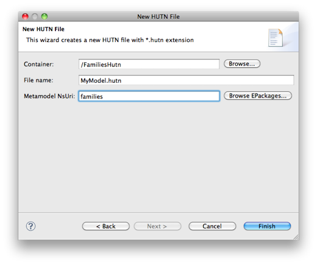
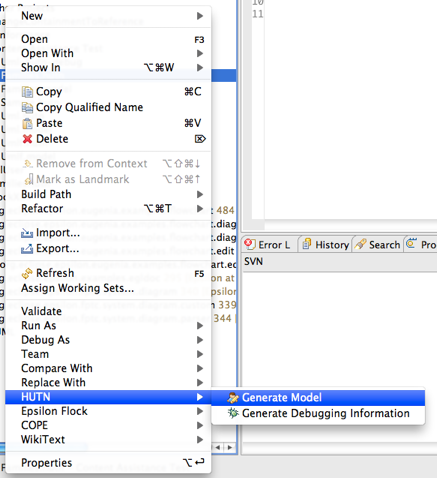

# Using the Human-Usable Textual Notation (HUTN) in Epsilon

In this article we demonstrate how you can use a textual notation to create models using the Human-Usable Textual Notation (HUTN) implementation provided by Epsilon. Please note that, currently, HUTN works only with EMF, and cannot be used to create models for other modelling technologies, such as MDR or plain XML.

## Getting started

To create a model with HUTN, we first need to define our metamodel. In this example, we'll use the Families metamodel shown below:

Once we have created your metamodel and registered it with Epsilon, we create a new HUTN document by clicking **File→New→Other\...** and selecting **HUTN File**. The metamodel nsuri field should contain the namespace URI of our metamodel: families

Epsilon will initialise a HUTN file for our metamodel (as shown below). We can now specify and then generate our model.

    @Spec {
      metamodel "families" {
        nsUri: "families"
      }
    }

    families {
      // Place your model element specifications here
    }

## HUTN Syntax

We now briefly describe the HUTN syntax. We can specify an instance of Family using the following HUTN:

    Family {
      name: "The Smiths"
      lotteryNumbers: 10, 24, 26, 32, 45, 49
    }

Note that multi-valued features can be specified using a comma separated list.

### Containment references

Containment references are specified by nesting model element definitions. For example, the following HUTN specifies two members, John and Jane of the Smiths:

    Family {
      name: "The Smiths"
      lotteryNumbers: 10, 24, 26, 32, 45, 49
      members: Person {
                 name: "John Smith"
               }, Person {
                 name: "Jane Smith"
               }
    }

### Non-containment references

Non-containment references are specified using a HUTN identifier, which is the string appearing in double-quotes as part of an object\'s declaraton. Below, the second Family has the identifier "bloggs." In the following HUTN, The first family references the second family, using the familyFriends reference:

    Family {
      familyFriends: Family "bloggs"
    }

    Family "bloggs" {}

### Cross-model references

References to model elements stored in another file are using a URI fragment:

    Family {
      familyFriends: Family "../families/AnotherNeighbourhood.model#/1/"
      familyFriends: Family "../families/AnotherNeighbourhood.model#_swAAYJX5Ed2TbbKclPHPaA"
    }

URI fragments can have either a relative (XPath-like) syntax, or use a unique identifier. For example, the first reference above uses a relative syntax to refer to the second (index of 1) Family in the AnotherNeighbourhood.model file. For more information on URI fragments, see the relevant section [here](http://learning.infocollections.com/ebook%202/Computer/Programming/Java/Eclipse.Modeling.Framework/0131425420_ch13lev1sec2.html).

## Shortcuts

There are some syntactic shortcuts in HUTN, which we now demonstrate.

Objects do not have to specify a body, and can instead be terminated with a semi-colon:

    Family {}
    // is equivalent to:
    Family;

Although boolean-valued attributes can be specified using true or false values, they can also be specified as a prefix on the model element definition:

    Family {
      nuclear: false
      migrant: true
    }
    // is equivalent to:
    ~nuclear migrant Family;

Non-containment references can be specified using association blocks or even with an infix notation:

    Family {
      familyFriends: Family "bloggs"
    }
    Family "bloggs";
    // is equivalent to the following association block
    Family "smiths";
    Family "bloggs";
    familyFriends {
      "smiths" "bloggs"
      // More familyFriends can be specified here
    }
    // is equivalent to the following infix notation:
    Family "smiths";
    Family "bloggs";
    Family "smiths" familyFriends Family "bloggs";

## Generating a model from HUTN

When we have finished specifying our HUTN, we can generate a corresponding model. Right-click the HUTN document and select **HUTN→Generate Model**, as shown below

Epsilon can automatically generate a model whenever you change your HUTN file. Right-click your project and select **HUTN→Enable HUTN Project Nature**. This is illustrated in the following screenshot:

## Additional resources

- <http://www.omg.org/spec/HUTN/>: The OMG HUTN specification.
- <http://dx.doi.org/10.1007/978-3-540-87875-9_18>: Our MoDELS/UML 2008 paper on the HUTN implementation provided by Epsilon.
