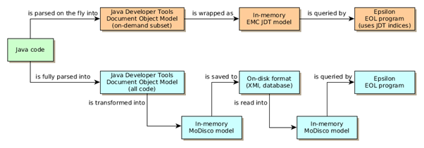
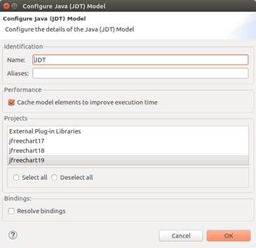
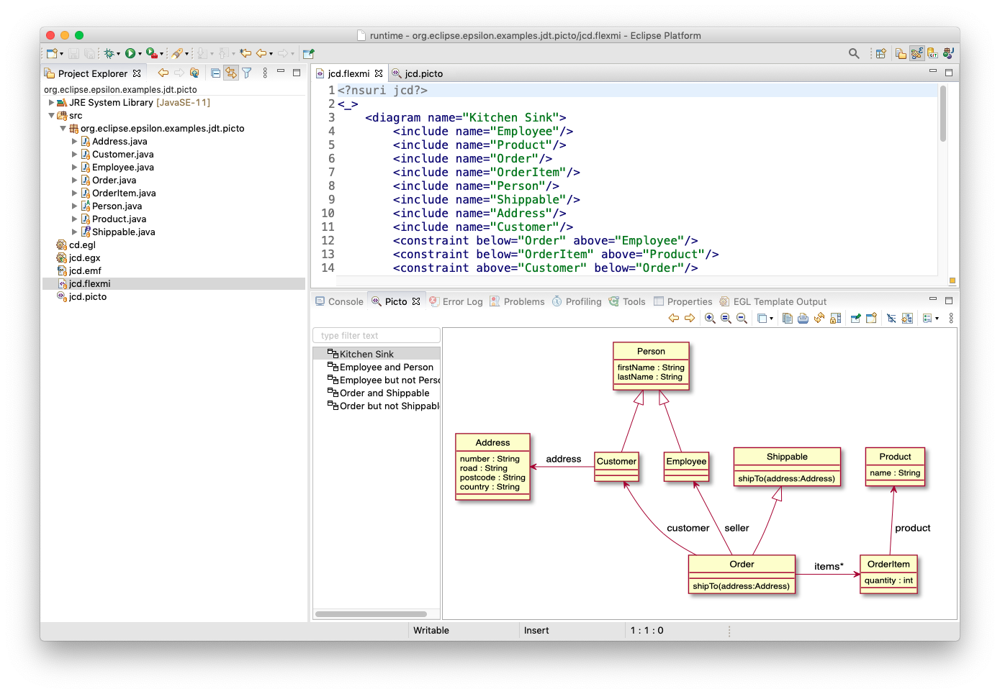

# Treating Java code as a model in Epsilon

In version 2.4 of Epsilon we introduced **a driver that allows Epsilon languages to query Java code as if it were a model**, using the internal representations of the Eclipse [Java Development Tools](https://www.eclipse.org/jdt/).

## But, wait a second, why should I want to do this?

There are many cases in which you may want to check things about your code. In many cases, a simple text-based search or the code navigation facilities in your IDE might be enough.  For instance, finding a class by name or listing its inherited methods  is something we do all the time.

However, **what if you want to check something very particular which is not supported by your IDE, and which involves “understanding” Java?** As an example, suppose that you want to find all the places in your  code where a new programmer may have used `==` to compare floating-point  numbers. This is a very [common mistake](http://floating-point-gui.de/errors/comparison/) that novices make.

**Text search won’t help you**: floating-point expressions and variables can be arbitrarily complex. You will need to parse the Java code, find these `==` comparisons and reimplement the bits of the Java Language Specification needed to find if one of the two sides is a floating-point expression. Too much work for a quick check you wanted to run on your code!

A simpler approach would be to have a tool give you a representation of the code that is close to how the  compiler thinks about it, and that you can go through easily. This is what we mean with having a *model*. In particular, this example would be solved with our tool by writing this snippet of EOL code:

```java
for (expr in InfixExpression.all) {
  if (expr.operator.toString() == "==") {
    var typeLExpr = 
      expr.leftOperand.resolveTypeBinding().qualifiedName;
    var typeRExpr =
      expr.rightOperand.resolveTypeBinding().qualifiedName;
    if (typeLExpr == "float" or typeRExpr == "float") {
      var cUnit = expr.root.javaElement.elementName;
      ("WARNING: in " + cUnit
       + ", tried to use == with a float: "
       + expr).println();
    }
  }
}
```

This query finds the `==` expressions  in your code, reuses the Eclipse Java Developer Tools to find if one of  the two sides is a `float` (we’re ignoring `double` to simplify things), and then reports any problems. It can handle non-trivial cases like method invocations, array accesses and so on. And all in 12 lines of  code.

## How does it differ from other tools?

The usual approach when exposing code as a model is to parse the code, dump it as a model (e.g in XMI) and  then treat it as usual. This approach is followed by popular tools such as [MoDisco](https://eclipse.org/MoDisco/), and it works well in “software modernization” situations in which you have a “frozen” legacy code base. This is the bottom path shown on this figure, starting from “Java code” and going to the cyan nodes:



 

However, **if you have an active codebase, having to extract a full model every time you make a change is tedious and slows you down**. Instead, it’d be better to just have something running in the  background keeping such a model up to date. The good news is that many IDEs already do this for their code navigation facilities, so we can piggyback on it without adding yet another background process to the  user experience.

Our EMC JDT driver is exactly that – we don’t do any big extraction work in advance, so the query starts  running almost immediately. The driver exposes the indices maintained by the Eclipse Java Development Tools, so you can quickly find a class and go through its methods, for instance. If at some point you need more  information than the indices provide, we’ll transparently use the JDT  parser (based on the Java compiler) to fetch things for you. This is  represented as the top path in the above figure, starting at “Java code” and going through the orange nodes.

## How is it used?

With Epsilon and the EMC JDT driver  installed, we create a new “query.eol” file with our query. For  instance, this one-liner prints how many types we have in our program:

````eol
TypeDeclaration.all.size.println("number of types: ");
````

To run it, we create a standard EOL launch configuration and then select the new “Java” model type: 


We then select a set of Eclipse Java projects to expose as a model: 



 

You can select multiple projects  through Ctrl+click – these will all be exposed as a single model. Here I have code for various versions of the [JFreeChart library](http://www.jfree.org/jfreechart/), and I have selected the code for the 1.0.19 version in particular.

Click on `OK`, then `Run`, and you’ll get your answer:

```
number of types: 1041
```

## What other things can I do?

While the previous example was very  simple, EOL is a fully-featured language, with support for loops,  user-defined operations, built-in data structures and full access to any Java library. In [this paper](https://oclworkshop.github.io/2016/papers/OCL16_paper_4.pdf) we showed **how to use it to validate your real Java code against a UML diagram, checking if perhaps your UML diagram had gone “stale”**. We found that using the EMC JDT driver would be faster than using  MoDisco if you just wanted to do this check repeatedly across multiple  releases.

Essentially, we expose the [JDT document object model (DOM)](https://help.eclipse.org/latest/index.jsp?topic=%2Forg.eclipse.jdt.doc.isv%2Freference%2Fapi%2Forg%2Feclipse%2Fjdt%2Fcore%2Fdom%2Fpackage-summary.html) directly through Epsilon, so if you want to access all instances of the JDT DOM [TypeDeclaration class](https://help.eclipse.org/latest/index.jsp?topic=%2Forg.eclipse.jdt.doc.isv%2Freference%2Fapi%2Forg%2Feclipse%2Fjdt%2Fcore%2Fdom%2FAST.html), you write `TypeDeclaration.all` as we did above. We also provide a few  convenient shorthands. For a TypeDeclaration t, you can use these:

- `t.public`,  `t.protected`, `t.private`, `t.static`, `t.abstract`, `t.final`: these are  true/false depending on whether the underlying type has this modifier.
- `t.name`: this exposes the name of the underlying type (which usually requires going through multiple fields).

We also expose the JDT index so you  can quickly find a type by name: in fact, it’s the same index you use  when pressing `CTRL+SHIFT+T` on Eclipse. To do so, you can use one of  these:

- `TypeDeclaration.all.select(td|td.name="someClass")` finds a type by name and returns it as a collection of TypeDeclarations with access to every detail within those types.
- `TypeDeclaration.all.search(td|td.name="someClass")` does the same, but it only returns the raw index entry (an instance of [IType](https://help.eclipse.org/latest/index.jsp?topic=%2Forg.eclipse.jdt.doc.isv%2Freference%2Fapi%2Forg%2Feclipse%2Fjdt%2Fcore%2FIType.html)), which is much faster but has less information.

## Applications

In [this example](https://git.eclipse.org/c/epsilon/org.eclipse.epsilon.git/tree/examples/org.eclipse.epsilon.examples.jdt.picto), we use the JDT driver and [Picto](../../picto) to generate PlantUML diagrams from existing Java code on the fly.



=== "jcd.flexmi"

    ```xml
    {{{ example("org.eclipse.epsilon.examples.jdt.picto/jcd.flexmi", true) }}}
    ```

=== "jcd.picto"

    ```xml
    {{{ example("org.eclipse.epsilon.examples.jdt.picto/jcd.picto", true) }}}
    ```

=== "jcd.egx"

    ```egx
    {{{ example("org.eclipse.epsilon.examples.jdt.picto/jcd.egx", true) }}}
    ```

=== "cd.egl"

    ```egl
    {{{ example("org.eclipse.epsilon.examples.jdt.picto/cd.egl", true) }}}
    ```
