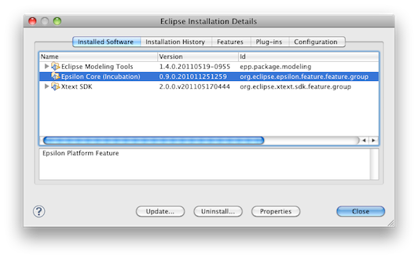
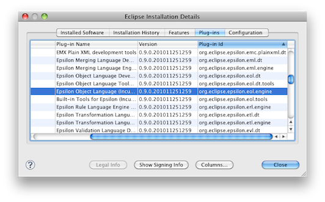
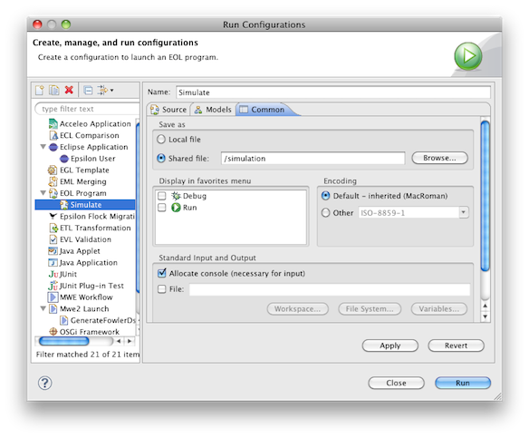

# Constructing a Helpful Minimal Example

From time to time, you may run into a problem when using Epsilon or find a bug. In these instances, we're happy to provide technical support and we endeavour to ensure that no question on our [forum](../../../forum) goes unanswered.

We often ask users to supply a **minimal example** that we can use to reproduce the problem on our machine. A high quality example often allows to send a much quicker and more accurate response. This article describes how to put together a useful example.

!!! tip "Constructing Minimal Examples in the Epsilon Playground"
    In many cases, the easiest way to create and share a minimal example is through the [Epsilon Playground](../../../live). Once you have put together your example, just click on the "Share" button and include the short link that pops up in your message on the forum.

Please include the following:

-   The version of Epsilon that you're running.
-   Instructions for reproducing the problem
-   A **minimal** version of all of the artefacts needed to reproduce the problem: models, metamodels (e.g. .ecore files), Epsilon programs (e.g. .eol, .evl, .etl, .egl files)
-   Where applicable, Eclipse launch configurations or Ant build files for your Epsilon programs.
-   An Eclipse project containing the minimal artefacts (and launch configurations or Ant build files). Please refrain from including files and folders that are not part of an Eclipse project as it is not always clear what we are expected to do with them.

The remainder of this article contains hints and tips for each of the
above. Once you have a minimal example, please attach it to a message in
the forum or
[email](mailto:epsilon.devs@gmail.com) it to us.

### Finding the version of Epsilon

When developing and maintaining Epsilon, we often work on several versions of Epsilon at once: we maintain separate interim and stable versions, and we often use separate development branches for experimental features. Consequently, we need to ensure that we're running the same version of Epsilon as you in order to reproduce your problem. To identify which version of Epsilon you have:

1.  Click **Help→About Eclipse** (on Mac OS X click **Eclipse→About Eclipse**).
2.  Click the **Installation Details** button
3.  Depending on how Epsilon has been installed, its version number may appear on the list of **Installed Software**:

1.  If not, click **Plug-ins**.
2.  Sort the list by the **Plug-in id** column by clicking the column title.
3.  Locate the row with **org.eclipse.epsilon.eol.engine** as its plug-in id, as shown below.

### Instructions for reproducing the problem

When reproducing your problem requires more than one or two steps, a short set of instructions is a great help for us. Please try to provide a list of steps that we can follow to reproduce the problem. For example:

1.  Open Example.model, and add a new Node with name "foo".
2.  Run the Foo2Bar.etl transformation with the supplied launch configuration.
3.  Open Example.model.
4.  Note that the Node that you added has not changed: it has not been transformed! The Node named "foo" should now be named "bar".

### A minimal version

Often, Epsilon users are manipulating large models with many thousands of elements, or executing Epsilon programs with many hundreds of lines of code. When investigating a problem or fixing a bug, it is extremely helpful for us to receive a minimal project that focuses exactly on the problem that you are encountering. In particular, please provide:

-   A small number of models, metamodels and Epsilon programs (ideally 1 of each).
-   Small models and metamodels (ideally with very few model elements).
-   Small programs (ideally containing only the code required to reproduce the problem).

!!! tip    
    Although it can take a little extra time for you to produce a minimal example, we really appreciate it. A minimal example allows us to spend more time fixing the problem and providing advice, and much less time trying to reproduce the problem on our computer. Also, based on our experience, messages that provide a minimal example tend to get answered much faster. On the other hand, examples which indicate little/no effort from the reporter's side to narrow down the problem (e.g. complete code dumps) tend to be pushed back to the end of the queue and can take significantly longer to investigate.

In some cases, building a minimal example is a great way to troubleshoot the problem that you're experiencing, and you may even find a solution to the problem while doing so.

### Epsilon launch configurations

When launching an Epsilon program from within Eclipse, it is common to produce a launch configuration, which defines the models on which an Epsilon program is executed. By default, Eclipse does not store these launch configurations in your workspace and hence they are not included in projects that are exported from your workspace.

To store an existing launch configuration in your workspace:

1.  Click **Run→Run Configurations**.
2.  Select the Epsilon program for which you wish to store a launch configuration from the left-hand pane.
3.  Select the **Common** tab.
4.  By default, under **Save as** the **Local** option is selected. Click **Shared file** and then **Browse**.
5.  Select the project that contains the Epsilon program from the dialogue box, and then click **Ok**, as shown below.
6.  Click **Apply**.
7.  Close the **Run Configurations** dialogue box.

Eclipse will create a new **.launch** file in your project, which contains all of the information needed to launch your Epsilon program, as shown below.

### Exporting an Eclipse project from your workspace

Once you have created a project containing a minimal example (and launch configurations or Ant scripts), you can create an archive file which can be emailed to us:

1.  Right-click your Project
2.  Click **Export\...**
3.  Under the **General** category, select **Archive File** and click **Next**.
4.  Ensure that the project(s) that you wish to export are checked in the left-hand pane.
5.  Supply a file name in the **To archive file** text box.
6.  Click **Finish**.

Please [email](mailto:epsilon.devs@gmail.com) the
resulting archive file to us.
