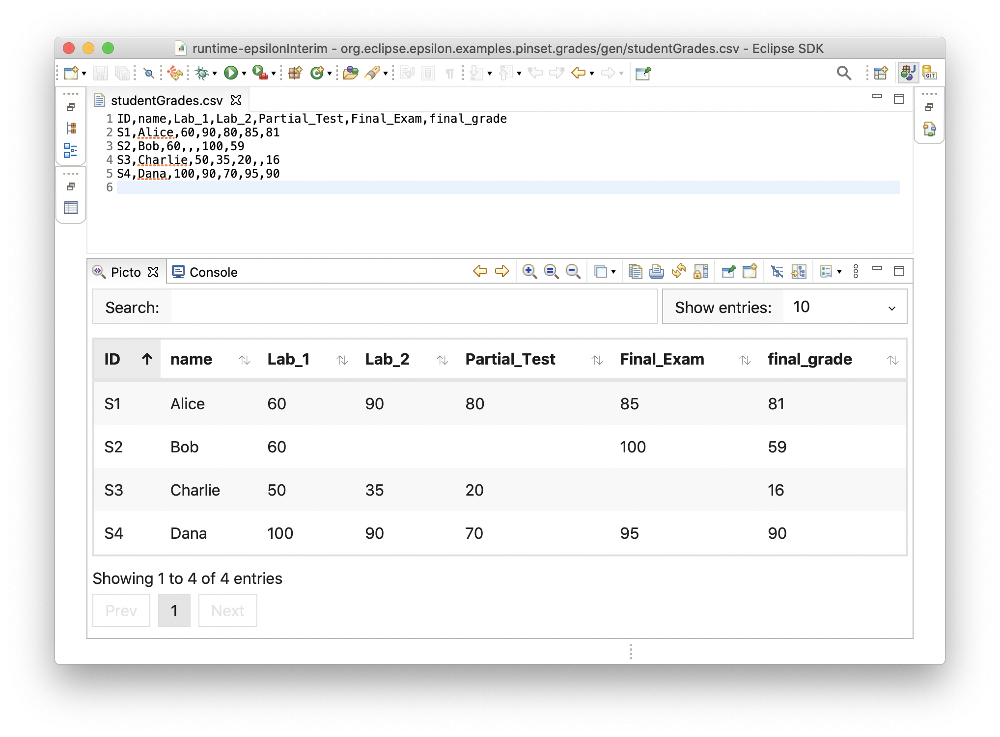

# Generating table views in Picto

This article shows how [Picto](../../picto) is able to render CSV files as enhanced HTML tables provided by the [Metro UI](https://metroui.org.ua/tables.html) library, which include table styling, pagination, column sorting, and search capabilities. It also shows how the [Pinset](../../pinset) language can be used to create these table views without having to generate CSVs through a general-purpose model-to-text transformation.

## Rendering CSV files in the workspace

Picto can be used to render CSV files present in an Eclipse project. The following figure shows the table generated for one of the output CSV files of the [Pinset](../../pinset) grading example:



To automatically render CSV files in Picto, the `Render verbatim sources` option needs to be enabled. This option can be turned on temporarily in the top-right hamburger menu option of the Picto window, or it can be permanently set in the Eclipse preferences (Epsilon > Picto).

## Generating table views with a Pinset transformation

[Pinset](../../pinset) is a domain-specific transformation language that allows extracting tabular datasets from models. Initially devised for data analysis purposes, this language can be used along Picto to generate table-based model visualisations.

In the Social Network example that can be found in the [Picto](../../picto) documentation, one of the views is generated with the following Pinset dataset rule:

```pinset
dataset personStats over person : Person {
	properties[name]

	column liked_by : Person.all.select(p |
			p.likes.includes(person)).size()
	column liking : person.likes.size()

	column disliked_by : Person.all.select(p |
			p.dislikes.includes(person)).size()
	column disliking : person.dislikes.size()

	column like_meter : liked_by - disliked_by
}
```

Briefly, a Pinset dataset rule contains EOL-based definitions of the different columns of the output dataset. These columns operate over elements of the input model (such as the `Person` elements in the rule above) to create the dataset rows. In the example, likes and dislikes counts are obtained for each `Person` element in the dataset. Check the [Pinset documentation](../../pinset) for more information about other features of the language such as advanced column generators.

To use the above Pinset rule to create a Picto view in the social network model visualisation, the following EGX rule is present in the `picto/socialnetwork.egx` file:

```egx
rule Persons2Table {

	template : "persons2table.pinset"

	parameters : Map {
		"path" = Sequence{"Stats"},
		"icon" = "table",
		"format" = "csv"

		// ,"pinsetrule" = "otherStats"
	}
}
```

The EGX rule above is very similar to the ones normally used for EGL templates. As differences, the rule points to a `.pinset` template file where the Pinset dataset rules are contained, and the defined icon and format are `table` and `csv` respectivelly. Lastly, as a Pinset file can contain several dataset rules, it is possible to select which rule to use in the visualisation with the `pinsetrule` parameter (commented out in the rule above).

The above EGX and Pinset rules generate the following table view:


