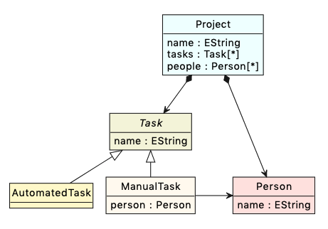
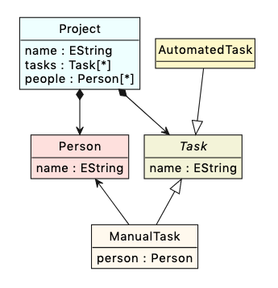

# Epsilon Playground

The [Epsilon Playground](../../../live) is a web application for fiddling with metamodelling, modelling and automated model management using [Emfatic](https://eclipse.org/emfatic), [Flexmi](../../flexmi) and Epsilon's languages. Its back-end is implemented using [Google Cloud Platform Functions](https://cloud.google.com/functions) and the front-end builds heavily on the [Metro 4](https://metroui.org.ua) framework. Diagrams are rendered using [PlantUML](https://plantuml.com) and [Kroki](https://kroki.io).

## Emfatic Metamodels in the Playground

For metamodelling, the Playground uses Ecore's [Emfatic](https://eclipse.org/emfatic) textual syntax, augmented with a couple of [annotations](https://www.eclipse.org/emfatic/#annotations) to control the graphical layout of the metamodels.

- `@diagram(direction="up/down/left/right")`: Can be attached to references (`val`/`ref`) to specify the direction of the respective edge in the diagram (`right` by default for non-containment references, and `down` for containment references)
- `@diagram(inheritance.direction="up/down/left/right")`: Can be attached to classes to specify the direction of its inheritance edges in the diagram (`up` by default).

For example, the plain Emfatic metamodel below is rendered as follows:

```emf
package ptl;

class Project {
    attr String name;
    val Task[*] tasks;
    val Person[*] people;
}

abstract class Task {
    attr String name;
}

class ManualTask extends Task {
    ref Person person;
}

class AutomatedTask extends Task {

}

class Person {
    attr String name;
}
```



while its annotated version produces the diagram below.

```emf
package ptl;

class Project {
    attr String name;
    val Task[*] tasks;
    val Person[*] people;
}

abstract class Task {
    attr String name;
}

class ManualTask extends Task {
    @diagram(direction="up")
    ref Person person;
}

@diagram(inheritance.direction="down")
class AutomatedTask extends Task {

}

class Person {
    attr String name;
}
```




## Saving and sharing your work

To save or share your work, please click the "Share" button. This will create a short link that you can copy to your clipboard. Please note that the contents of your editors **will be stored in the back-end of the Epsilon Playground** so that they can be retrieved when you visit that link again later.

## Fair usage policy

The cost of running Epsilon Playground is proportional to the number of requests made to its Google Cloud Platform back-end (i.e. execution of programs and rendering of diagrams). With fair usage we can comfortably afford this cost and keep the Playground operational, but in case of excessive use we may have to take it down with no notice. To keep costs down, server-side operations that take more than 60 seconds to complete are automatically terminated. For extensive use, large models, or complex programs, please use the [development tools / Java libraries](../../../download) provided on the Epsilon website instead, or run your own instance of the Epsilon Playground in a [Docker container](https://github.com/epsilonlabs/playground-docker).

## Reporting bugs and requesting help
Please submit bug reports in the [Eclipse Bugzilla](https://bugs.eclipse.org/bugs/enter_bug.cgi?product=epsilon) and ask for help in [Epsilon's forum](../../../forum). You can submit feature requests too but please keep in mind that the Playground is not a replacement for Epsilon's [Eclipse-based development tools](../../../download). The Playground has been cursorily tested on recent versions of Firefox and Chrome. It's unlikely that we'll be able to invest too much effort in making it compatible with older/other browsers but any patches you may be able to contribute are always welcome.