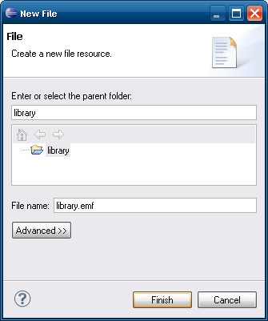
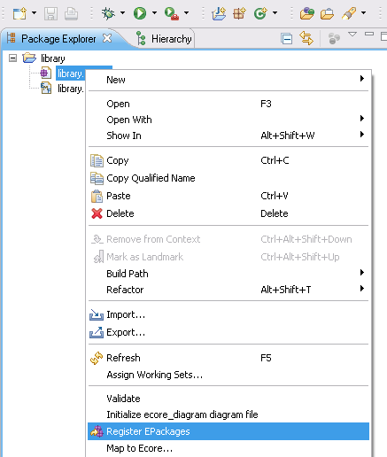
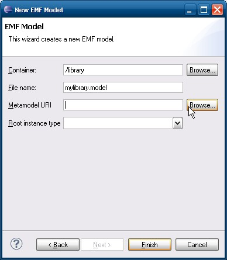
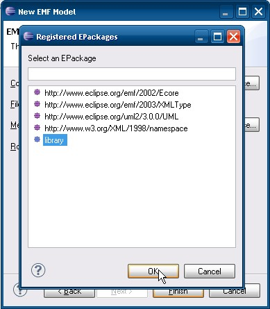
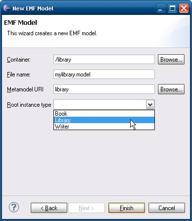
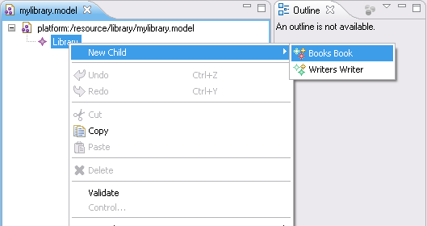
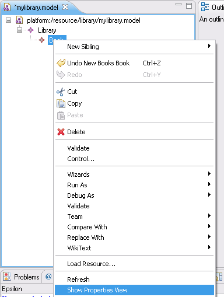
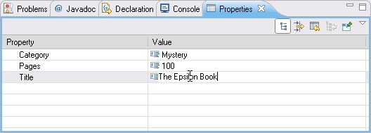

# Reflective EMF Tutorial
 
This tutorial demonstrates how to create an EMF Ecore metamodel and a sample model that conforms to it reflectively (i.e. without generating any code).

## Prerequisites
 
To go through this tutorial you need to first install the Eclipse Modeling Distribution, Epsilon and Emfatic. Installation instructions are available [here](../../../download).

## Create a new project
 
Go to `File->New->Other...` and select `General->Project`. Type `library` as the project name:


## Create library.emf
 
Go to `File->New->Other...` and select `File`. Type `library.emf` as the file name:



This is where we'll specify our Ecore metamodel using the Emfatic textual syntax

## Add content to library.emf
 
Now `library.emf` should be open and you can copy-paste the following text into it (our sample metamodel) and save.

```emf
@namespace(uri="library", prefix="")
package library;

class Library {
   val Writer[*] writers;
   val Book[*] books;
}

class Writer {
   attr String name;
   ref Book[*] books;
}

class Book {
   attr String title;
   attr int pages = 100;
   attr BookCategory category;
}

enum BookCategory {
   Mystery;
   ScienceFiction;
   Biography;
}
```

Now your `library.emf` editor should look like this:


## Generate library.ecore from library.emf
 
The next step is to generate a proper XMI-based Ecore metamodel from the Emfatic textual representation. To do this, you can right-click `library.emf` and select `Generate Ecore model` as shown below:


Once you've done this you should have a new file called `library.ecore` sitting next to your `library.emf`. Congratulations! You're half-way there!

!!! info "Tip"
    If at some point you change `library.emf`, you need to repeat this step in order to update `library.ecore`.

## Register library.ecore
 
The next step is to let EMF know of the existence of your newly created `library.ecore` metamodel. To do this, right-click `library.ecore` and select `Register EPackages` as shown below:



## Create a model that conforms to library.ecore
 
Now we're ready to create models that conform to our new Ecore metamodel! To create a model, go to `File->New->Other...` and select `EMF Model` as shown below:


Click `Next` and set the name of the model to `mylibrary.model`:



Then hit the `Browse...` button next to the `Metamodel URI` field and select `library` in the list that pops up:



Finally, select `Library` from the `Root instance type` combo box and hit `Finish`:



Now `mylibrary.model` should be open in a tree-based editor:


## Add content to mylibrary.model
 
To create a new `Book` under the library, you can right-click it and select `New Child->Books Book`



To set the title of the new book, you can right-click it and select `Show Properties View`



Then, in the `Title` field of the `Properties` view, you can type the name of the book:



!!! success "Congratulations!"
    You've just created your first EMF model!