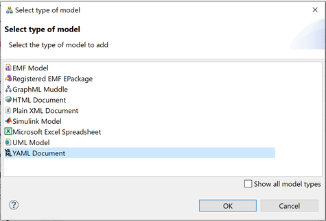
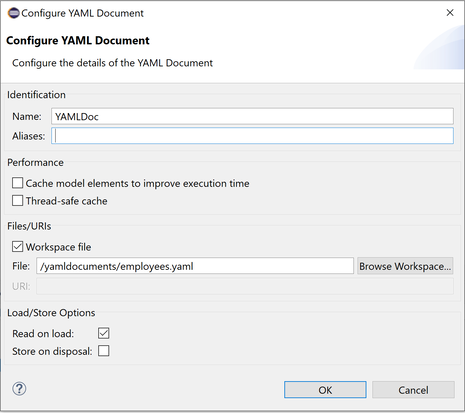

# Scripting YAML documents using Epsilon
 
In this article we demonstrate how you can create, query and modify YAML documents in Epsilon programs using the YAML driver. All the examples in this article demonstrate using EOL to script YAML documents. However, it's worth stressing that YAML documents are supported throughout Epsilon. Therefore, you can use Epsilon to (cross-)validate, transform (to other models – XML, CSV or EMF-based, or to text), compare and merge your YAML documents.

<iframe width="90%" height="494" src="https://www.youtube.com/embed/TF0fgghP938" frameborder="0" allow="accelerometer; autoplay; encrypted-media; gyroscope; picture-in-picture" allowfullscreen></iframe>

## Querying a YAML document
 
We use the following `employees.yaml` as a base for demonstrating the EOL syntax for querying YAML documents.

```yaml
- employeeId: 14623
  address:
    country: England
    resident: true
    postcode: M1 1AG
  fullname: Michael Davidson
  role: Consultant
  industry: [IoT, smart factories, signal analytics]
  projects:
    - {name: SmartAutomation, budget: 25000}
    - {name: FactoryAnalytics, budget: 20000}
  
- employeeId: 16431
  address: {country: Germany}
  fullname: Arnold Wagner
  role: HR
  skills:
    - communication
    - coaching
```

## Querying/modifying YAML documents in EOL
 
The YAML driver uses predefined naming conventions to allow developers to programmatically access and modify YAML documents in a concise way. A type of YAML node must be specified when accessing YAML nodes via the YAML driver. There are 3 types of nodes in YAML:

- `Scalar Node`. Scalar nodes are used to represent a single scalar value (e.g., string, boolean, integer). In the YAML driver, a scalar node consists of a key-value pair, in which the key represents the name of the scalar node, and the value represents the scalar value.
- `Mapping Node`. Mapping nodes are used to represent unordered collections of key-value pairs. In the YAML driver, a mapping node consists of a key-value pair, in which the key represents the name of the mapping node, and the value holds an unordered collection of key-value pairs, which in turn represent other nodes.
- `List (Sequence) Node`. List nodes are used to represent an ordered list of nodes or scalar values. In the YAML driver, a list node consists of a key-value pair, in which the key represents the name of the list node, and the value represents a list of nodes or scalar values.

This section outlines the supported conventions in the form of questions and answers followed by relevant examples.

### How can I access all node elements?
 
Retrieving all nodes, regardless of their type, is performed by using the keyword `Node`, followed by the property `all`. One can access all nodes of a specific type, by using the keyword `ScalarNode` for scalar nodes, `MappingNode` for mapping nodes, and `ListNode` for list nodes.

```eol
// Get and print all nodes
Node.all.println();

// Get and print all scalar nodes
ScalarNode.all.println();

// Get and print all mapping nodes
MappingNode.all.println();

// Get and print all list nodes
ListNode.all.println();
```

### How can I access nodes by name?
 
The `s_` prefix followed by the name of the node is used to access all scalar nodes with the specified name. Similarly, the `m_` prefix is used for accessing mapping nodes, and the `l_` prefix for list nodes. For instance, `s_role.all` can be used to get all scalar nodes named `role`, `m_address.all` can be used to get all mapping nodes named `address`, and `l_industry.all` can be used to get all list nodes named `industry`.

```eol
// Get all scalar nodes with the name "role" and print the first one
s_role.all.first().println();

// Get all mapping nodes with the name "address" and print the first one
m_address.all.first().println();

// Get all list nodes with the name "industry" and print the first one
l_industry.all.first().println();
```

### How can I retrieve nodes as a sequence of elements or as a single element?
 
One can specify how nodes can be retrieved, either as a sequence or as a single element. After the prefix of the node type (i.e., `s` for scalar node, `m` for mapping node, `l` for list node), one can use an additional prefix `c_` to specify that nodes should be retrieved as a sequence, or can use `e_` to specify that a single node should be retrieved. For instance, `se_country` specifies that a single scalar node named `country` should be retrieved, whereas `sc_country` specifies that the node named `country` should be retrieved in a sequence. Using the additional prefix `e_` can eliminate the need for using further accessor functions (e.g., `first`, `last`, `at`).

```eol
// Get the first "address" mapping node
var address = m_address.all.first();

// Get and print the "country" scalar node in a sequence (c_)
address.sc_country.println();

// Get and print the "country" scalar node as a single element (e_)
address.se_country.println();
```

### How can I access the name of a node?
 
One may be interested in verifying the name of a node for debugging programs, and for this purpose, the `name` property can be used.

```eol
// Get the first "industry" list node
var industry = l_industry.all.first();

// Get and print the name of the node
industry.name.println();
```

### How can I access the type of a node?
 
One may be interested in verifying the type of a node for debugging programs, and for this purpose, the `type` property can be used.

```eol
// Get the first "role" scalar node
var role = s_role.all.first();

// Get and print the type of the node
role.type.println(); // ScalarNode
```

### How can I access the value of a node?
 
The `value` property can be used for accessing the value of a node. The value of a node can be converted into different types using the following prefixes:

- `s_` for strings
- `i_` for integers
- `d_` for doubles
- `f_` for floats
- `b_` for booleans

```eol
var employeeVal = s_employeeId.all.first().value; // 14623
var s_employeeVal = s_employeeId.all.first().s_value + 1; // 146231
var i_employeeVal = s_employeeId.all.first().i_value + 1; // 14624
var d_employeeVal = s_employeeId.all.first().d_value + 1; // 14624.0
var f_employeeVal = s_employeeId.all.first().f_value + 1; // 14624.0
var b_residentVal = s_resident.all.first().b_value; // true
```

### How can I create a node?
 
To create a new node, you can use the `new` operator followed by the type of node (i.e., `ScalarNode`, `MappingNode`, `ListNode`). Alternatively, the convention for accessing nodes can be used for creating nodes. For instance, one can use the `new` operator followed by `s_role` to create a scalar node named `role`.

```eol
// scalar node named "city" with the value "Berlin"
var cityNode1 = new ScalarNode("city", "Berlin"); // city=Berlin
var cityNode2 = new s_city("Berlin"); // city=Berlin

// empty mapping node named "address"; its value must be set later
var addressNode1 = new MappingNode("address"); // address={}
var addressNode2 = new m_address; // address={}

// empty list node named "books" that contains 5 entries; its values must be set later
var booksNode1 = new ListNode("books", 5); // books=[{}, {}, {}, {}, {}]
var booksNode2 = new l_books(5); // books=[{}, {}, {}, {}, {}]
```

### How do I set the value of a node?
 
For setting or changing the value of a node, the `value` property can be used, followed by the assignment operator (“=”) and a value or a node. If a node is specified after the assignment operator, then the name of that node will be ignored, and the value of that node will become the new value after the assignment operation. The function `set(position, value)` can be used for modifying the items of a list node.

```eol
// changes the value of the first "fullname" scalar node to "Jack"
s_fullname.all.at(0).value = "Jack";

// changes the value of the first "role" scalar node to "Developer"
s_role.all.first().value = new ScalarNode("newNode", "Developer");

// changes the value of the "country" scalar node to "Turkey"
m_address.all.first().se_country.value = "Turkey";

// changes the last "address" mapping node into a scalar node with the value "Street Broadway"
m_address.all.last().value = new s_newNode("Street Broadway");

// changes the last "role" scalar node into an empty mapping node
s_role.all.last().value = new MappingNode();

// changes the last "employeeId" scalar node into a list node that contains 3 empty entries
s_employeeId.all.last().value = new ListNode("newNode", 3); 

// changes in the "skills" list node the value of the item at position 1 to "databases"
l_skills.all.first().value.set(1, "databases");
```

### How do I add entries to a list node?
 
The function `add(value)` can be used for adding an item to a list node that contains scalar values. The functions `addRow()` and `addRows(size)` can be used for adding empty entries to a list node that contains nodes.

```eol
// add an item to the "skills" list node
l_skills.all.first().value.add("analytics");

// add 1 empty entry to the "projects" list node
l_projects.all.first().value.addRow();

// add 3 empty entries to the "projects" list node
l_projects.all.first().value.addRows(3);
```

### How do I add nodes to a mapping node?
 
The `appendNode(node)` function can be used for adding new nodes into a mapping node.

```eol
var address = m_address.all.last();

// add a new scalar node with the name "city" and value "Berlin"
address.value.appendNode(new ScalarNode("city", "Berlin"));
```

### How do I set the root node of a YAML document?

The `root` property can be used for setting the root node of a YAML document. The root node of a YAML document can either be a mapping node or a list node. The `setRootAsMap()` function can be used for setting the root node into a mapping node. The `setRootAsList()` function can be used for setting the root node into a list node.

```eol
// Set the root node into a mapping node
YAMLDoc.setRootAsMap();

// Set the root node into a list node
YAMLDoc.setRootAsList();

// Set the root node into a mapping node
YAMLDoc.root.value = new MappingNode();

// Set the root node into a list node with 3 empty entries
YAMLDoc.root.value = new ListNode("", 3);
```

### How can I create a YAML document from scratch?

The following code can be used for creating the `employees.yaml` file programmatically.

```eol
YAMLDoc.setRootAsList();
var root = YAMLDoc.getRoot();
root.value.addRows(2);
var rootFirstRow = root.value.at(0);
var rootSecondRow = root.value.at(1);

var addressNode1 = new MappingNode("address");
var countryNode1 = new ScalarNode("country", "England");
var residentNode = new ScalarNode("resident", true);
var postcodeNode = new ScalarNode("postcode", "M1 1AG");
addressNode1.value.appendNode(countryNode1);
addressNode1.value.appendNode(residentNode);
addressNode1.value.appendNode(postcodeNode);

var employeeIdNode1 = new ScalarNode("employeeId", "14623");
var fullnameNode1 = new ScalarNode("fullname", "Michael Davidson");
var roleNode1 = new ScalarNode("role", "Consultant");

var industryNode = new ListNode("industry", 3);
industryNode.value =  Sequence{"IoT", "smart factories", "signal analytics"};

var projectsNode = new ListNode("projects", 2);
var nameNode1 = new ScalarNode("name", "SmartAutomation");
var nameNode2 = new ScalarNode("name", "FactoryAnalytics");
var budgetNode1 = new ScalarNode("budget", 25000);
var budgetNode2 = new ScalarNode("budget", 20000);
projectsNode.value.at(0).appendNode(nameNode1);
projectsNode.value.at(0).appendNode(budgetNode1);
projectsNode.value.at(1).appendNode(nameNode2);
projectsNode.value.at(1).appendNode(budgetNode2);

var addressNode2 = new MappingNode("address");
var countryNode2 = new ScalarNode("country", "Germany");
addressNode2.value.appendNode(countryNode2);

var employeeIdNode2 = new ScalarNode("employeeId", "16431");
var fullnameNode2 = new ScalarNode("fullname", "Arnold Wagner");
var roleNode2 = new ScalarNode("role", "HR");

var skillsNode = new ListNode("skills", 2);
skillsNode.value =  Sequence{"communication", "coaching"};

rootFirstRow.appendNode(employeeIdNode1);
rootFirstRow.appendNode(addressNode1);
rootFirstRow.appendNode(fullnameNode1);
rootFirstRow.appendNode(roleNode1);
rootFirstRow.appendNode(industryNode);
rootFirstRow.appendNode(projectsNode);

rootSecondRow.appendNode(employeeIdNode2);
rootSecondRow.appendNode(addressNode2);
rootSecondRow.appendNode(fullnameNode2);
rootSecondRow.appendNode(roleNode2);
rootSecondRow.appendNode(skillsNode);
```

### How can I delete nodes?

To delete nodes, you can use the `delete` operator followed by the node(s) to be deleted.

```eol
// delete all scalar nodes named "role"
delete s_role.all;

// delete the first mapping node named "address"
delete m_address.all.first();

// delete all list nodes named "skills"
delete l_skills.all;
```

## Adding a YAML document to your launch configuration
 
To add a YAML document to your Epsilon launch configuration, you need to select "YAML Document" from the list of available model types.



Then you can configure the details of your document (name, file etc.) in the screen that pops up. To load a YAML document that is not in the Eclipse workspace, untick the "Workspace file" check box and provide a full URI for your document (e.g. `http://api.twitter.com/followers/epsilonews.yaml` or `file:/c:/employees.yaml`).


 
## Loading a YAML document through Java code
 
The following excerpt demonstrates using YAML models using Epsilon's Java API.

```java
EolModule module = new EolModule();
module.parse(new File("..."));

YamlModel model = new YamlModel();
model.setName("YAMLDoc");
model.setFile(new File("..."));
model.load();

module.getContext().getModelRepository().addModel(model);
module.getContext().setModule(module);
module.execute();
```

## Additional resources
 
* [MDENet Community](https://community.mde-network.org/courses/4609253/content): Additional learning resources about MDE with the Epsilon Framework