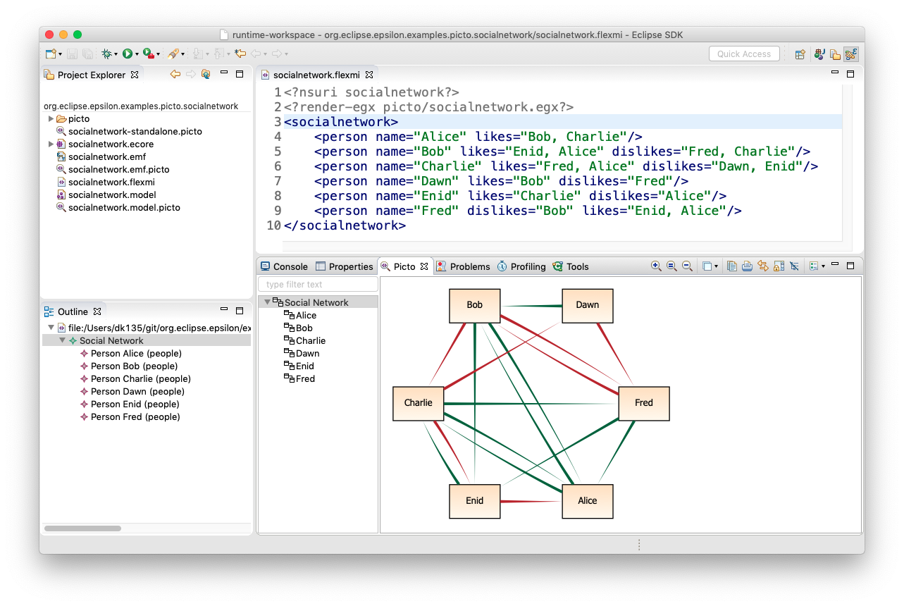
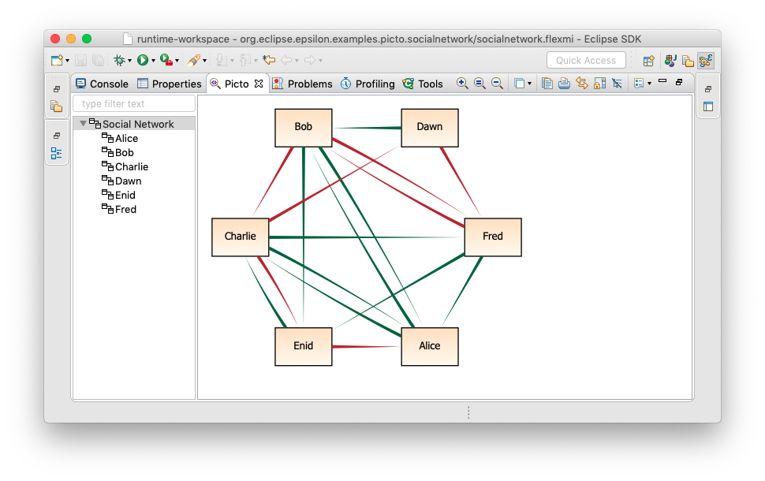
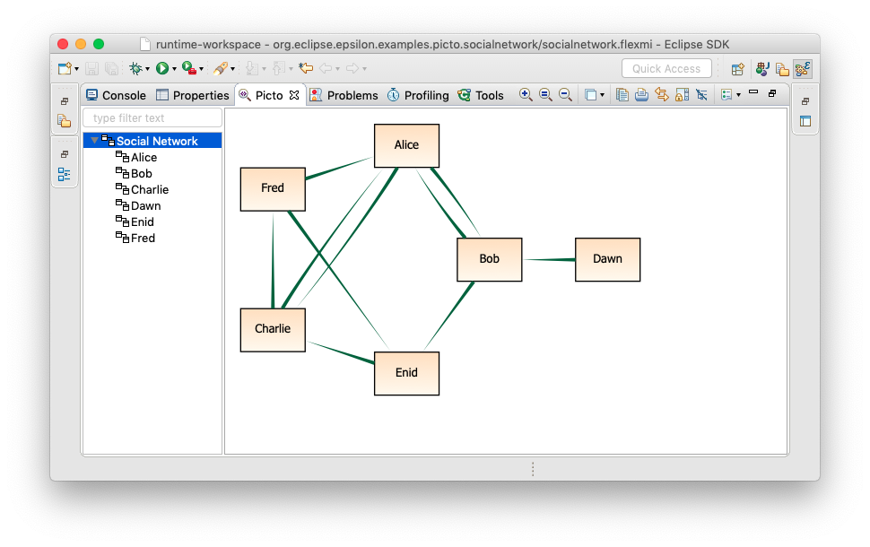
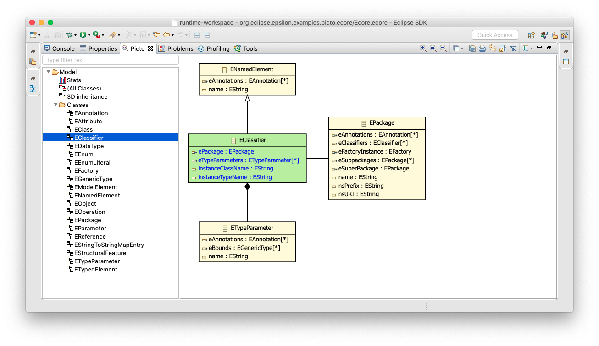
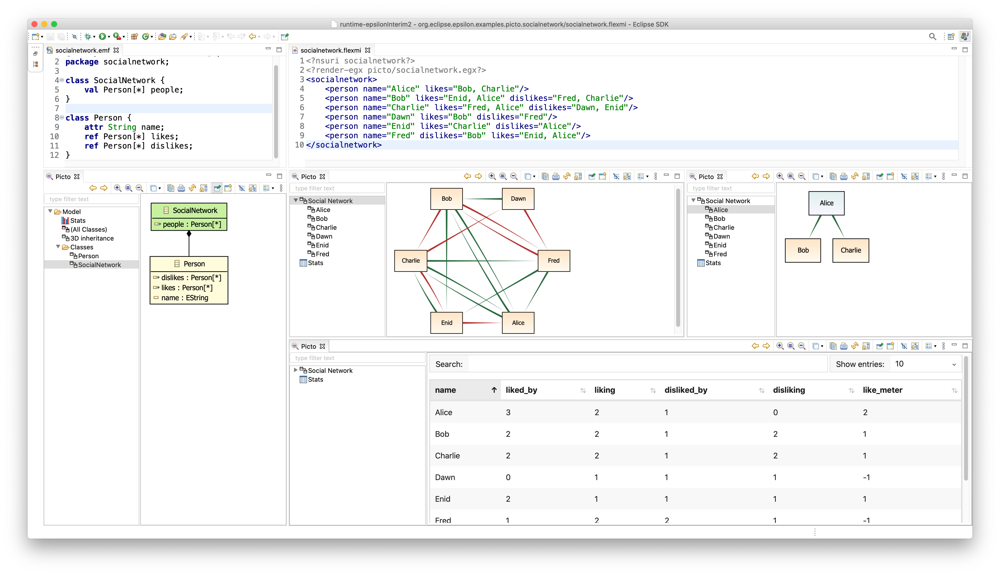
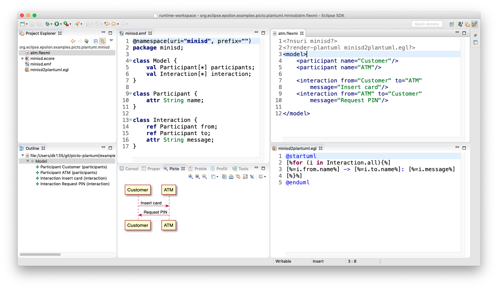
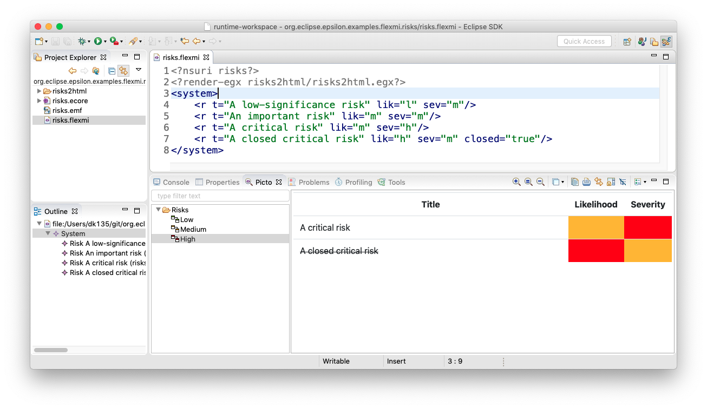
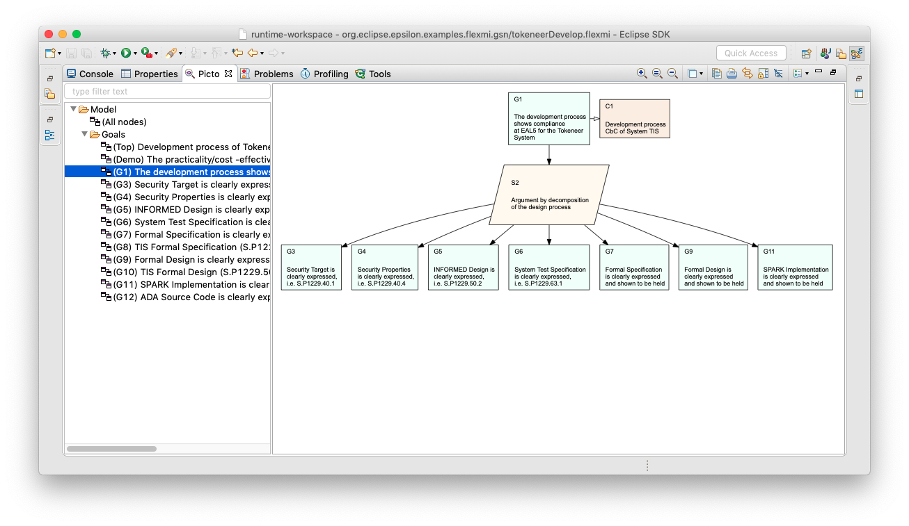
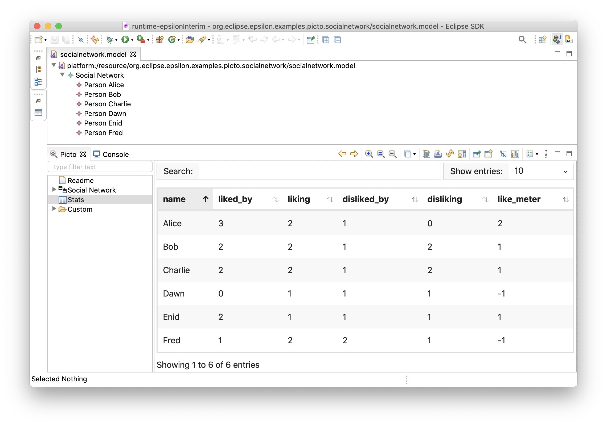

# Visualising Models with Picto

Picto is an Eclipse view for **visualising models via model-to-text transformation** to SVG/HTML. Compared to existing graphical modelling frameworks such as [Sirius](https://eclipse.org/sirius) and [GMF/Eugenia](../articles/eugenia-gmf-tutorial), the main appeal of Picto is that model visualisation takes place in an embedded browser and therefore you can leverage any HTML/SVG/JavaScript-based technology such as [D3.js](https://d3js.org/), [mxGraph](https://github.com/jgraph/mxgraph) and [JointJS](https://www.jointjs.com/). Picto also provides built-in support for the powerful [Graphviz](https://www.graphviz.org/) and [PlantUML](https://plantuml.com/) textual syntaxes (which are transformed to SVG via the respective tools). A distinguishing feature of Picto is that it does not require running multiple Eclipse instances as the metamodels, models and visualisation transformations can all reside in the same workspace.

!!! tip
	As Picto uses [EGL](../egl) for model-to-text transformation, it is [not limited to EMF-based models](#using-picto-in-standalone-mode-with-many-models) and can be used to visualise the contents of Simulink models, XML documents, spreadsheets, and any other type of artefact supported by an [Epsilon EMC driver](../emc).


??? info "Citing Picto in a publication?"
	If you are referring to Picto in a publication, please cite [this paper](https://dl.acm.org/doi/10.1145/3365438.3410943) instead of the website URL. A pre-print of the paper is available [here](http://eprints.whiterose.ac.uk/164209/).

On the flip side, Picto displays read-only views of models and as such it is not a good fit if diagram-based model editing capabilities are required. In this article we demonstrate Picto through a small social network example. The complete source code of the example is available [here](https://git.eclipse.org/c/epsilon/org.eclipse.epsilon.git/plain/examples/org.eclipse.epsilon.examples.picto.socialnetwork/).



## Metamodel
We start with the metamodel of our social network DSL expressed in [Emfatic](https://www.eclipse.org/emfatic/) (the `.ecore` version of the metamodel is also provided in the repository). The DSL allows modelling people in a network and likes/dislikes relationships between them.

```emf
@namespace(uri="socialnetwork", prefix="")
package socialnetwork;

class SocialNetwork {
	val Person[*] people;
}

class Person {
	attr String name;
	ref Person[*] likes;
	ref Person[*] dislikes;
}
```

## Model
Below is a model that conforms to the social network metamodel. The model is defined for convenience in [Flexmi](../flexmi), however Picto also works with XMI-based models (see below).

```xml
<?nsuri socialnetwork?>
<?render-egx picto/socialnetwork.egx?>
<socialnetwork>
	<person name="Alice" likes="Bob, Charlie"/>
	<person name="Bob" likes="Enid, Alice" dislikes="Fred, Charlie"/>
	<person name="Charlie" likes="Fred, Alice" dislikes="Dawn, Enid"/>
	<person name="Dawn" likes="Bob" dislikes="Fred"/>
	<person name="Enid" likes="Charlie" dislikes="Alice"/>
	<person name="Fred" dislikes="Bob" likes="Enid, Alice"/>
</socialnetwork>
```

In line 2 of the model, notice the `render-egx` processing instruction, which specifies a model-to-text transformation written in [EGX/EGL](../egx/), that Picto should use to visualise this model.

## Model-to-Text Transformation
The `socialnetwork.egx` EGX model-to-text transformation is as follows:

```egx
rule Network2Graphviz
	transform n : socialnetwork::SocialNetwork {

	template : "socialnetwork2graphviz.egl"

	parameters : Map{
		"path" = Sequence{"Social Network"},
		"icon" = "diagram-ffffff",
		"format" = "graphviz-circo",
		"layers" = Sequence {
			Map {"id"="likes", "title"="Likes", "active"=true},
			Map {"id"="dislikes", "title"="Dislikes", "active"=true}
		},
		"people" = n.people
	}

}

rule Person2Graphviz
	transform p : socialnetwork::Person {

	template : "socialnetwork2graphviz.egl"

	parameters : Map{
		"path" = Sequence{"Social Network", p.name},
		"icon" = "diagram-c0c0c0",
		"format" = "graphviz-dot",
		"layers" = Sequence {
			Map {"id"="likes", "title"="Likes", "active"=true},
			Map {"id"="dislikes", "title"="Dislikes", "active"=true}
		},
		"people" = Sequence{p}
	}

}
```

The transformation consists of two rules:

* `Network2Graphviz` which will be executed once and will produce a Graphviz graph for the entire network
* `Person2Graphviz` which will be executed for every person in the network and produce the person's own local likes/dislikes graph

Each rule specifies the EGL template that it will invoke (`socialnetwork2graphviz.egl` in both cases here) as well as a set of parameters that Picto needs. The parameters are as follows:

* `path`: A collection of strings that specify the path of the produced view in the Picto tree
* `icon`: The icon of the view on the Picto tree. Allowed values at the moment are file names (without the extension) of all icon files under [this folder](https://git.eclipse.org/c/epsilon/org.eclipse.epsilon.git/tree/plugins/org.eclipse.epsilon.picto/icons), as well as `diagram-rrggbb` values where `rrggbb` is a hex colour. Additionally, you can extend the available set of icons by populating an `icons` folder next to the model-to-text transformation file that defines your Picto visualisation (e.g. next to `socialnetwork.egx`)
* `format`: The format of the view that the EGL transformation will produce. Built-in formats currently supported are `graphviz-dot`, `graphviz-circo`, `graphviz-neato`, `graphviz-fdp`, `plantuml`, `text`, `html` and `svg`
* `layers`: A sequence of maps, each of which represents a layer of the view. Each layer needs to define an `id`, a `title` and (optionally), whether it is `active` by default

The EGL template `socialnetwork2graphviz.egl` is as follows:

```egl
digraph G {
	node[shape=rectangle, fontname=Tahoma, fontsize=10, style="filled",
		gradientangle="270", fillcolor="bisque:floralwhite"]

	edge[penwidth=3, style=tapered, arrowhead=none]

[%for (p in people){%]

	[%=p.name%] [%if (people.size()==1)%]

	[%if (isLayerActive("likes")){%]
		[%for (l in p.likes){%]
			[%=p.name%] -> [%=l.name%] [color="#2A6C41"]
		[%}%]
	[%}%]

	[%if (isLayerActive("dislikes")){%]
		[%for (l in p.dislikes){%]
			[%=p.name%] -> [%=l.name%] [color="#B43431"]
		[%}%]
	[%}%]

[%}%]

}

[%
operation isLayerActive(id : String) {
	var layer = layers.selectOne(l|l.id = id);
	if (layer.isDefined()) {
		return layer.active;
	}
	else {
		return true;
	}
}
%]
```

## Result

Every time `socialnetwork.flexmi` is saved, Picto will run the EGX/EGL transformation and display the results in a view that consists of a tree viewer and a browser. For this model, Picto produces 7 diagrams; one for the network as a whole through the application of the `Network2Graphviz` rule and one for each person in the network through the application of the `Person2Graphviz` rule. Screenshots of the populated Picto view appear below.




## Layers

Picto supports the concept of layers to allow users to show/hide information on a diagram. Both EGX rules specify a "likes" and a "dislikes" layer (lines 11-12 and 29-30) which the user can turn on/off to show/hide like/dislike relationships in the current diagram. Hiding the "dislikes" layer, makes the network-level diagram look like this.



## Scalability

Picto works in a lazy way and initially computes only the details needed to show the tree of views (view paths and icons) on its left-hand side. The content of individual views is computed on demand when a user clicks on a view in the Picto tree. We have used Picto with models and visualisation transformations that produce hundreds of deeply nested views without performance issues. Having said that, as models grow in size, the time it takes the underlying modelling framework (e.g. EMF) to load them into memory and the time it takes EGL to process them are also bound to grow. In such cases, consider fragmenting your models across many files. It is also important to try and do as little work as possible at the EGX level and carry out any expensive computations within the EGL templates instead.

When targeting Graphviz or PlantUML it is also advisable to keep your generated diagrams relatively small as auto-layout is computationally expensive (particularly routing edges) and rendering your views can take a long time. For example, generating the Graphviz representation of the full UML metamodel class diagram (260+ classes/650+ references) is instantaneous but getting Graphviz's dot program to render it takes hours. In any event, such a diagram would have been unreadable, and hence pointless (see the 20-class/50-references diagram of Ecore.ecore below, which is generated and rendered instantaneously).


To "protect" your visualisation rules from input that is bound to generate meaningless output you can use guards as shown below.

```egx
rule ClassDiagram {

	guard : EClass.all.size() < 30

	parameters : Map {
		"classes" = EClass.all,
		"format" = "graphviz-dot",
		"path" = List{"Model", "(All Classes)"},
		"icon" = "diagram-ff0000"
	}

	template: "ecore2dot.egl"

}
```

In such cases, it is preferable to generate many smaller diagrams; for this example, a class diagram for each class of the metamodel, surrounded by its super/sub/referenced types.

## Interactive Diagrams

Diagrams can also be linked to each other and link back to the models from which they were generated. For example, clicking any of the yellow classes in the diagram below takes you to the respective diagram and clicking on the green EClassifer class, takes you to the class definition in the Ecore editor. This is achieved through two built-in JavaScript functions below, which are showcased [here](https://git.eclipse.org/c/epsilon/org.eclipse.epsilon.git/plain/examples/org.eclipse.epsilon.examples.picto.ecore/ecore2vis/classdiagram.egl).

| Signature                                         | Description                                                  |
| ------------------------------------------------- | ------------------------------------------------------------ |
| showView(String[] path)                           | Shows the view with the specified path - e.g. `top.showView(['Model', 'Classes', 'EClassifier'])` |
| showElement(String elementId, String resourceUri) | Selects the specified element in its Eclipse-based editor (e.g. the EMF tree-based editor) |




## Multiple Picto Views

It is possible to open several Picto views in the same Eclipse workbench, which can be pinned to the same or different model editors. In the image below, the class diagram on the bottom left is pinned to the Social Network metamodel shown in the top left. The three Picto windows on the bottom right contain different views of the social network model shown in the tree editor of the top right.



## Editors supported by Picto

* Any editor that implements EMF's `IEditingDomainProvider` interface (e.g. the reflective Ecore editor, Exeed) as long as next to the edited file there is a file with the same name and a `.picto` suffix providing the format of the visualisation and the EGL template to be used (see the XMI-based `socialnetwork.model` and `socialnetwork.model.picto` files in the example directory)
* Flexmi editor: as long as the Flexmi model contains a `<?render-xxx ?>` processing instruction
* Emfatic editor
* Default text editor editing files with `.html`, `.svg`, `.dot`, `.neato` file extensions (mainly for debugging)

## Extending Picto

Picto provides the following extension points that can be used to extend its functionality.

| Extension Point                                  | Description                                                  |
| ------------------------------------------------ | ------------------------------------------------------------ |
| org.eclipse.epsilon.picto.pictoSource            | Bind Picto to a type of Eclipse-based editors so that Picto auto-refreshes every time a file in an editor of this type is saved |
| org.eclipse.epsilon.picto.browserFunction        | Add a custom Javascript function that generated diagrams can call (much like the `showView` and `showElement` functions above) |
| org.eclipse.epsilon.picto.browserScript          | Add a Javascript that executes when the Picto browser loads  |
| org.eclipse.epsilon.picto.viewContentTransformer | Transform a custom content type to HTML, or to a content type that another [ViewContentTransformer](https://git.eclipse.org/c/epsilon/org.eclipse.epsilon.git/plain/plugins/org.eclipse.epsilon.picto/src/org/eclipse/epsilon/picto/transformers/ViewContentTransformer.java) can transform. See [MarkdownContentTransformer](https://git.eclipse.org/c/epsilon/org.eclipse.epsilon.git/plain/plugins/org.eclipse.epsilon.picto/src/org/eclipse/epsilon/picto/transformers/MarkdownContentTransformer.java) as an example. |
| org.eclipse.epsilon.picto.htmlElementTransformer | Add support for custom HTML elements to Picto. See [PictoViewElementTransformer](https://git.eclipse.org/c/epsilon/org.eclipse.epsilon.git/plain/plugins/org.eclipse.epsilon.picto/src/org/eclipse/epsilon/picto/transformers/elements/PictoViewElementTransformer.java) as an example, which adds a new `<picto-view path="..."/>` HTML tag to Picto, that supports embedding Picto views [within other Picto views](https://git.eclipse.org/c/epsilon/org.eclipse.epsilon.git/plain/examples/org.eclipse.epsilon.examples.picto.ecore/comps/readme.html). |

Please see this [plugin.xml](https://git.eclipse.org/c/epsilon/org.eclipse.epsilon.git/plain/plugins/org.eclipse.epsilon.picto/plugin.xml), which shows how some of these extension points were used to integrate Picto with different technologies, such as [PlantUML](https://plantuml.com/) or [Mermaid](https://github.com/mermaid-js/mermaid).

## Using Picto in standalone mode / with many models

Picto also suports a standalone mode, where the details of the models to be visualised are provided within the `.picto` file itself. An example of visualising `socialnetwork.model` in standalone mode (without the model being open in a tree editor) is below and in `socialnetwork-standalone.picto` in the example folder.

```xml
<?nsuri picto?>
<picto format="egx" transformation="picto/socialnetwork.egx" standalone="true">
	<model type="EMF">
		<parameter name="name" value="M"/>
		<parameter name="metamodelUri" value="socialnetwork"/>
		<parameter name="modelFile" file="socialnetwork.model"/>
	</model>
</picto>
```

## Troubleshooting

* If you can't find the Picto view, you will need to upgrade to a version of Epsilon >= 2.0
* Graphviz (on which the PlantUML integration also depends) does not ship as part of Picto. You will need to install it manually on your computer.

## Philosophy

While EMF provides support for [reflective model instantiation](../articles/reflective-emf-tutorial) within the same Eclipse workspace, graphical and textual modelling frameworks that sit on top of it such as GMF, Sirius and Xtext involve code generation and/or contributing to Eclipse extension points and hence require spawning a new Eclipse instance. While this inconvenience can pay off for large DSLs, it feels like an overkill when one needs to throw together a small DSL in situ. The original aim of Picto was to complement Flexmi in this respect by contributing model visualisation capabilities where creating a new dedicated graphical editor is considered to be an overkill.

## Gallery









## Additional Resources

Additional resources about Picto are available [here](../articles/#picto).
