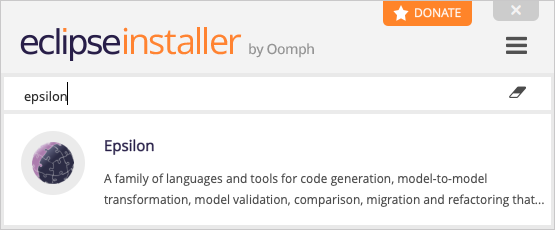

# Eclipse Epsilon 

Epsilon is a family of Java-based scripting languages for automating common model-based software engineering tasks, such as [code generation](doc/egl), [model-to-model transformation](doc/etl) and [model validation](doc/evl), that work out of the box with EMF (including [Xtext](https://www.eclipse.org/Xtext) and [Sirius](https://www.eclipse.org/sirius)), UML, Simulink, XML and [other types of models](doc/emc). Epsilon also includes Eclipse-based editors and debuggers, convenient reflective tools for [textual modelling](doc/flexmi) and [model visualisation](doc/picto), and [Apache Ant](doc/workflow) tasks.

  

  

  

  

  

  

!!! info "Online Playground"

	If you prefer not to download/install anything just quite yet, you can fiddle with EMF models and metamodels, and with some of the Epsilon languages in the online [Epsilon Playground](live).

## Installation

Download the [Eclipse Installer](https://wiki.eclipse.org/Eclipse_Installer) and select Epsilon, as shown below. Note that you will need a Java Runtime Environment installed on your system. More options for downloading Epsilon (update sites, Maven) are [available here](download).

## Why Epsilon?

- **One syntax to rule them all:** All languages in Epsilon build on top of a [common expression language](doc/eol) which means that you can reuse code across your model-to-model transformations, code generators, validation constraints etc.
- **Integrated development tools:**  All languages in Epsilon are supported by editors providing syntax and error highlighting, code templates, and graphical tools for configuring, running, debugging and profiling Epsilon programs. 
- **Documentation, Documentation, Documentation:** More than [60 articles](doc/articles), [15 screencasts](doc/screencasts) and [40 examples](doc/examples) are available to help you get from novice to expert.
- **Strong support for EMF:** Epsilon supports all flavours of EMF, including reflective, generated and non-XMI (textual) models such as these specified using Xtext or EMFText-based DSLs.
- **No EMF? No problem:** While Epsilon provides strong support for EMF, it is not bound to EMF at all. In fact, support for EMF is implemented as a driver for the model connectivity layer of Epsilon. Other drivers provide support for XML, CSV, Simulink and you can even roll out your own driver!
- **No Eclipse? No problem either:** While Epsilon provides strong support for Eclipse, we also provide [standalone JARs through Maven Central](download/#maven) that you can use to [embed Epsilon in your plain Java](doc/articles/run-epsilon-from-java) or Android application.
- **Mix and match:** Epsilon poses no constraints on the number/type of models you can use in the same program. For example, you can write a transformation that transforms an XML-based and an EMF-based model into a Simulink model and also modifies the source EMF model.
- **Plumbing included:** You can use the [ANT Epsilon tasks](doc/workflow) to compose Epsilon programs into complex workflows. Programs executed in the same workflow can share models and even pass parameters to each other.
- **Extensible:** Almost every aspect of Epsilon is extensible. You can add support for your [own type of models](doc/articles/developing-a-new-emc-driver), extend the Eclipse-based development tools, add a new method to the String type, or even implement [your own model management language](doc/articles/developing-a-new-language) on top of EOL.
- **Java is your friend:** You can call methods of Java classes from all Epsilon programs to reuse code you have already written or to perform tasks that Epsilon languages do not support natively.
- **Parallel execution:** Since 2.0, Epsilon is multi-threaded, which includes first-order operations and some of the rule-based languages, making it faster than other interpreted tools.
- **All questions answered:** The [Epsilon forum](forum) contains more than 9,500 posts and we're proud that no question has ever gone unanswered.
- **We're working on it:** Epsilon has been an Eclipse project since 2006 and it's not going away any time soon.

## License

Epsilon is licensed under the [Eclipse Public License 2.0](https://www.eclipse.org/legal/epl-2.0/).